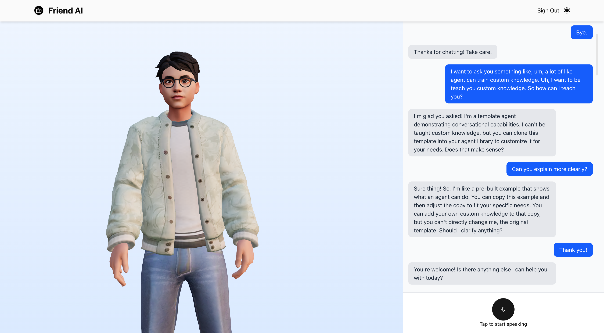

<div >
  <br />
   <div align="center" >
    <a href="https://youtu.be/zA9r5zTllx4" target="_blank">
      
    </a>
    </div>
  <br />
  <br />

  <div>
    
    
    
    
   
  </div>

  <h3 style="font-weight:700;font-size:30px;">Friend (Ai Avatar Chat App)</h3>

   <div >
     An immersive AI chat experience featuring a realistic 3D avatar, natural conversations, and fluid animations. 🤖✨
    </div>
  <br />
  <div align="center">
    <a href="URL_ADDRESS-ai.vercel.app/" target="_blank">
      
    </a>
  </div>

</div>

## Table of Contents

- [📝 Overview](#overview)
- [✨ Features](#features)
- [🛠️ Tech Stack](#tech-stack)
- [🚀 Getting Started](#getting-started)
  - [⚙️ Installation](#installation)
- [🎨 Asset](#asset)
- [📬 Contact](#contact)

## Overview

Friend Ai is an innovative AI chat application that combines cutting-edge technologies to create a uniquely engaging conversational experience. The app core features:

- **Realistic 3D Avatar**: A meticulously designed virtual companion that provides visual feedback during conversations
- **Real-time Animations**: Fluid motion and expressions that bring the avatar to life
- **Immersive Interface**: A clean, modern UI design that focuses on the conversation experience
- **Cross-platform Compatibility**: Built with Next.js for seamless performance across devices

The project aims to bridge the gap between traditional chatbots and more personalized AI interactions by providing users with a visually engaging and emotionally responsive virtual friend.

## Features

🎭 **Expressive Avatar**

- Lifelike 3D character with realistic facial expressions
- Smooth, natural animations that respond to conversation
- Dynamic gestures and body language

🧠 **Thai AI Integration**

- Powered by ElevenLabs conversation agent
- Natural Thai language processing
- Contextual understanding in Thai
- Culturally-aware responses

💫 **Interactive Experience**

- Real-time response animations
- Voice interaction capabilities

🎨 **Modern Design**

- Clean and intuitive user interface
- Responsive layout for all devices
- Animated Dark/light mode support

📧 **Email Verification**

- Secure email verification system
- Powered by Resend API
- Instant verification delivery

## Tech Stack

- ⚡ **Framework:** [Next.js](https://nextjs.org/) (v15)
- ⚛️ **Frontend:** [React 19](https://react.dev/), [Tailwind CSS v4](https://tailwindcss.com/)
- 🧊 **3D & Animation:** [Three.js](https://threejs.org/), [@react-three/fiber](https://docs.pmnd.rs/react-three-fiber/getting-started/introduction), [@react-three/drei](https://docs.pmnd.rs/drei/introduction)
- 🔐 **Authentication:** [next-auth](https://next-auth.js.org/) with [@auth/prisma-adapter](https://authjs.dev/reference/adapter/prisma)
- 🗄️ **Database ORM:** [Prisma](https://www.prisma.io/) with [PostgreSQL](https://www.postgresql.org/)
- 📝 **Form Handling & Validation:** [react-hook-form](https://react-hook-form.com/), [zod](https://zod.dev/)
- 📧 **Email:** [Resend](https://resend.com/) (for verification)
- 🗣️ **Voice AI:** [@11labs/react](https://www.npmjs.com/package/@11labs/react) (ElevenLabs conversation agent)
- 🖼️ **Icons:** [Lucide React](https://lucide.dev/)

## Getting Started

To get started with Friend AI, follow these steps to set up the project locally.

### Installation

1. Clone the repository:

```bash
git clone https://github.com/TerryMinn/Friend.git
cd friend-ai
```

2. Install the dependencies:

```bash
# npm
npm install

# pnpm
pnpm install

# yarn
yarn install
```

3. Set up your environment variables:

- Create a `.env.local` file in the root directory.
- Add the following variables:

```bash
DATABASE_URL=
NEXTAUTH_SECRET=
NEXTAUTH_URL=
RESEND_API_KEY=
NEXT_PUBLIC_ELEVENLABS_AGENT_ID=
```

4. Run the development server:

```bash
npm run dev

# pnpm
pnpm dev

# yarn
yarn dev
```

5. Open your browser and navigate to `http://localhost:3000` to view the app.

## Asset

- 🪮 Animations: [`/public/animations`](https://github.com/TerryMinn/Friend/tree/main/public/animations)
- 🧍 3D Model: [`/public/model`](https://github.com/TerryMinn/Friend/tree/main/public/model)
- 🖼️ Images: [`/public/images`](https://github.com/TerryMinn/Friend/tree/main/public/images)
- 🌐 **Deployment Platform**: [Vercel](https://vercel.com/)
- 🗄️ **Database Hosting**: [Neon DB](https://neon.tech/)
- 🗣️ **Voice AI Service**: [ElevenLabs](https://elevenlabs.io/)

## Contact

Feel free to reach out if you have any questions or suggestions!

- GitHub: [@TerryMinn](https://github.com/TerryMinn)
- Twitter: [@TerryMinn](https://x.com/ShinnThantMinn2)
- Email: devwithterry@gmail.com
